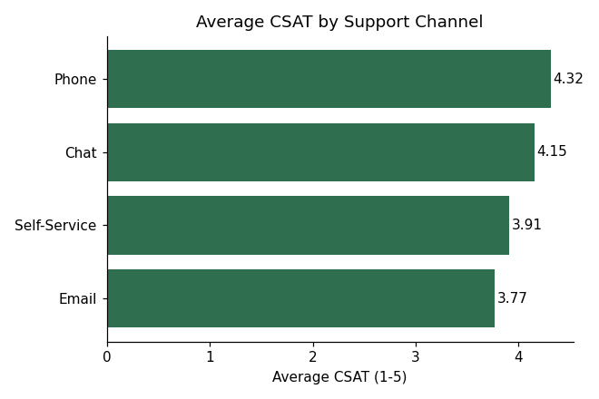
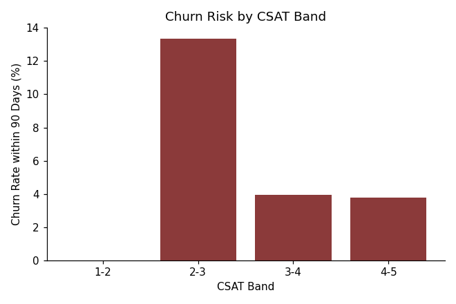
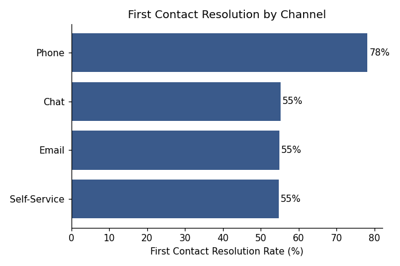
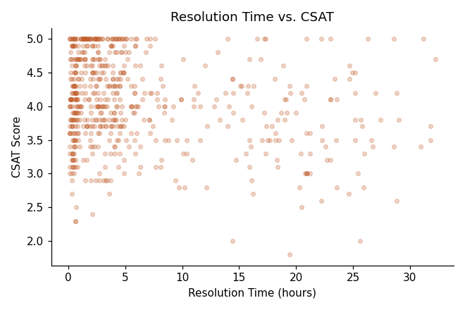

# CX Analytics Dashboard

Analyzes 3,000 synthetic customer support tickets to answer the
questions a CX or Customer Success leader actually needs answered: which
channels are underperforming, where CSAT is at risk, and what's actually
correlated with churn — with a concrete recommendation at the end, not
just charts.

## Key finding

Tickets with CSAT below 3 churn within 90 days at **~3.7x** the rate of
tickets with CSAT of 4+. That gap is large enough to justify a
proactive "save play" (CS outreach) triggered automatically whenever a
ticket closes with a low CSAT score — a concrete, low-effort
intervention with a clear business case behind it.

## Charts

**CSAT by channel** — Email lags Phone and Chat, flagging it as the
place to start if you want to move the overall CSAT number.



**Churn rate by CSAT band** — the relationship isn't linear; churn risk
jumps sharply once CSAT drops below 3.



**First contact resolution by channel** — Phone resolves most issues on
the first contact; Self-Service and Email lag, suggesting where deflection
or better self-service content could help.



**Resolution time vs. CSAT** — sanity-checks the assumption that faster
resolution always means happier customers (the relationship is weaker
than you'd expect — worth digging into qualitatively, not just
quantitatively).



## Run it

```bash
pip install -r requirements.txt
python analyze.py
```

## Dataset

`data/cx_tickets.csv` — synthetic support tickets (Jan 2024–Dec 2025)
across 4 channels, 4 regions, and 5 issue types, with CSAT, resolution
time, first-contact-resolution, and 90-day churn flag. Generated with
numpy; not sourced from any real company's data.

## Possible extensions

- Segment the churn/CSAT relationship by issue type or region
- Build a simple logistic regression to predict churn probability from
  ticket-level features
- Turn this into a live Power BI / Tableau dashboard instead of static
  charts
